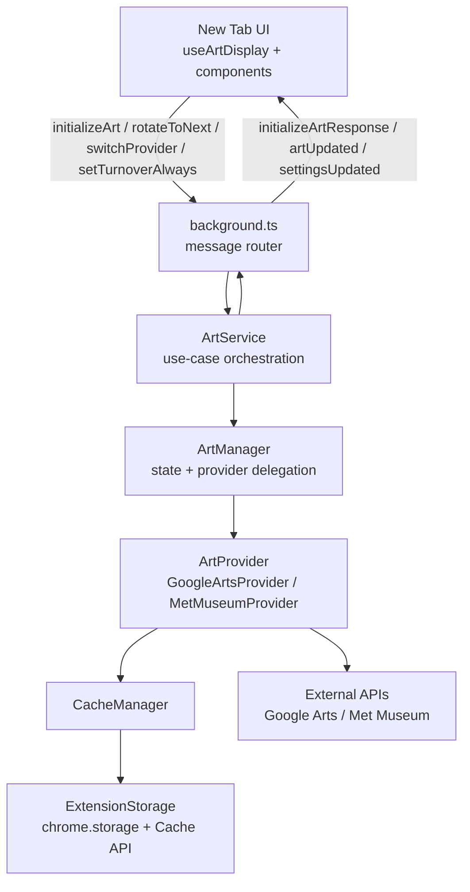

# Arts and Culture New Tab - Firefox Extension

Firefox extension that transforms your new tab into a curated art gallery featuring works from Google Arts & Culture and Metropolitan Museum.

Inspired by [Google Arts and Culture extension](https://chromewebstore.google.com/detail/google-arts-culture/akimgimeeoiognljlfchpbkpfbmeapkh?hl=en)

## Build Requirements

- **Node.js**: v18.0.0 or higher
- **Package Manager**: pnpm (recommended) or npm
- **Operating System**: macOS, Linux, or Windows

## Build Instructions

1. **Install Node.js and pnpm**:

   ```bash
   # Install Node.js from https://nodejs.org
   # Install pnpm globally
   npm install -g pnpm
   ```

2. **Clone and build the extension**:

   ```bash
   git clone https://github.com/aade-sh/arts-culture-firefox-extension
   cd arts-and-culture-firefox-extension
   pnpm install
   pnpm run build
   ```

3. **Add required icons** to `icons/` directory (16x16, 32x32, 48x48, 128x128 px)

4. **Load in Firefox**:
   - Open `about:debugging` → "This Firefox"
   - Click "Load Temporary Add-on" → select `manifest.json`

## Build Scripts

Available commands:

```bash
pnpm run build           # Build both newtab and background scripts
pnpm run build:newtab    # Build only the newtab component
pnpm run build:background # Build only the background script
pnpm run ext:lint        # Validate extension with web-ext
pnpm run ext:build       # Build and package extension (.xpi)
pnpm run ext:run         # Build and run extension in Firefox via web-ext
pnpm run dev             # Build and watch for changes
pnpm run test            # Run test suite
pnpm run test:watch      # Run tests in watch mode
pnpm run test:coverage   # Run tests with coverage
pnpm run clean           # Clean build artifacts
```

The build process uses:

- **Vite** for fast bundling and development
- **TypeScript** compilation with ES2020 target
- **Preact** with React compatibility layer
- Code bundling and minification for production
- Generates `newtab/newtab-bundle.js` and `dist/background.js`

## Project Structure

```
├── manifest.json
├── src/
│   ├── background/
│   │   ├── background.ts        # Runtime message router/adapter
│   │   ├── container.ts         # Composition root (wires dependencies)
│   │   ├── art-service.ts       # Background orchestration/use-cases
│   │   ├── art-manager.ts       # State + provider delegation
│   │   ├── cache-manager.ts     # Metadata + image cache abstraction
│   │   ├── storage.ts           # Browser storage/cache API wrapper
│   │   └── providers/
│   │       ├── art-provider-base.ts
│   │       ├── google-arts-provider.ts
│   │       └── met-museum-provider.ts
│   ├── components/
│   ├── hooks/
│   ├── models/
│   ├── types/
│   │   ├── index.ts             # Domain types/interfaces
│   │   └── runtime-messages.ts  # Shared UI/background message contracts
│   └── newtab.tsx
├── tests/
├── newtab/
├── dist/
└── icons/
```

## Architecture

### Core Design

The extension uses a layered background architecture with explicit dependency wiring:

- `background.ts` is the transport adapter (Chrome runtime events/messages).
- `art-service.ts` owns orchestration logic (initialize, rotate, switch provider, toggle settings).
- `art-manager.ts` owns persisted/runtime state and delegates content operations to providers.
- Providers encapsulate source-specific fetch/sync/asset-validation behavior.
- `runtime-messages.ts` is the shared typed message contract between UI and background.

### High-Level Design (HLD)



### Data Flow

1. UI sends typed runtime message.
2. Background router forwards to `ArtService`.
3. `ArtService` coordinates policy (daily/per-tab rotation, prefetch, switching).
4. `ArtManager` reads/writes state and delegates provider operations.
5. Provider loads data/images using `CacheManager` + `ExtensionStorage`.
6. Background broadcasts typed response/update events back to new-tab pages.

### Storage

The extension uses two different storage mechanisms for optimal performance:

- **Chrome Storage API** (`chrome.storage.local`) - For JSON data including:
  - Art metadata (titles, creators, URLs)
  - Cache timestamps and asset counts
  - User settings and preferences
- **Web Cache API** (`caches`) - For binary image data:
  - Cached artwork images
  - Optimized for large binary assets
  - Namespace-isolated per art provider

All storage operations are abstracted through the `ExtensionStorage` class in `src/background/storage.ts`.

## Legal

This is an **unofficial educational project** not affiliated with Google. Art data is accessed through reverse-engineered endpoints and remains property of respective museums and Google Arts & Culture.

## License

MIT License
